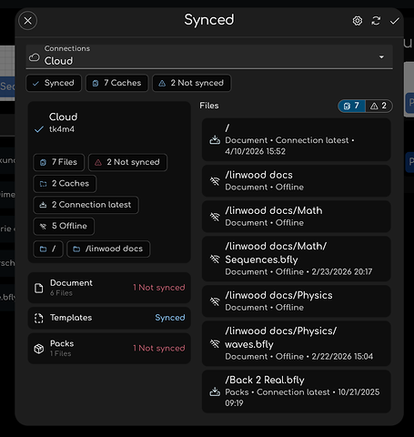

Finally, the awaited release of 2.5.2 is here!

This is a stable release, it includes all the changes from the 2.5.2 nightly releases.

Have a look at the nightly version blog entries below to see all the changes in detail:

- [2.5.2-rc.0](/butterfly/2.5.2-rc.0)
- [2.5.2-rc.1](/butterfly/2.5.2-rc.1)
- [2.5.2-rc.2](/butterfly/2.5.2-rc.2)
- [2.5.2-rc.3](/butterfly/2.5.2-rc.3)

The previous 2.5.1 release notes: [2.5.1 release blog entry](/butterfly/2.5.1).

## Highlights

<Table>
<TableItem href="#webdav">
  ☁️ *Major* improvements to Sync and WebDAV connections
</TableItem>
<TableItem href="#pdf">
  📄️ PDF Import and Export Improvements
</TableItem>
<TableItem href="#input">
  🖱️ Input improvements (multi-input experiment)
</TableItem>
<TableItem href="#selection-transform-control">
  🎯 Improved selection and transform controls
</TableItem>
<TableItem href="#android">
  📱️ Android Files and Sharing
</TableItem>
<TableItem href="#fps">
  ⚡️ Performance improvements
</TableItem>
</Table>

## *Major* improvements to Sync and WebDAV connections \{#webdav\}

Using WebDAV in Butterfly is better with the newly added *sync overview*.
Now you can manage connections and make sure that files are in sync and caches (offline copies) of your files are working as expected.

This also should make managing a lot of connections easier. Feedback is very welcome about this feature.

Besides the new overview, improvements to the interface make it easy to sync files and their caches.
Along with many optimizations and fixes.

## PDF Import and Export Improvements \{#pdf\}

Would you believe it? This release fixes multiple bugs when importing PDFs.
One of them was related to the option called "Spread to pages." Try this option now after it has been fixed. :)

Importing a PDF will use the original file name for its name.

There are also many fixes for importing and exporting in general.

## Input improvements (multi-input experiment) \{#input\}

A new experiment has been added to allow mapping of double clicks and triple clicks to actions just like touch.

## Improved selection and transform controls \{#selection-transform-control\}

Selection and navigation behavior has been improved in several places. Transform controls for the select tool now work better on small selections, smooth navigation has been fixed when viewport limits are enabled, and lock options now apply correctly in the label tool, polygon tool, and click actions on the select tool.

## Android Files and Sharing \{#android\}

The default directory option in Android is buggy due to permission issues.
In hopes of fixing this issue in Android, there is _another_ experiment that enables Android's Storage Access Framework (SAF), which might fix the issue for you.

By the way, always make backups of your notes; it's simple. Here is how to do so in Butterfly: Data > Export all files.

There are also improvements, of course; we can't have a bug fix update without improvements that may haunt us back with new bugs, and then regret the entire improvement

Anyway, Butterfly now supports the sharing menu; you can share PDFs with Butterfly to start editing them quickly.

## Performance improvements \{#fps\}

What can I say...
Every version is speedier than ever.
And this version is no exception.

Undoing and redoing in Butterfly should be faster. No need to be punished for making mistakes as a human!
And some memory leaks have been fixed; there is one large memory leak that isnt fixed yet, which hopefully will be fixed after the refactor.
