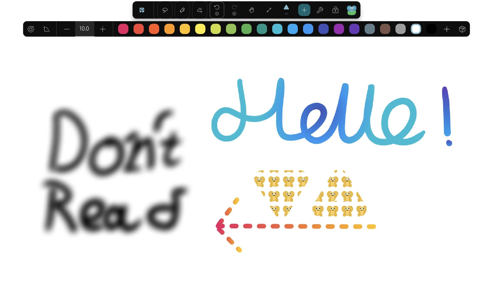

Too sleepy, eh? It's been a while since the last stable release, but **no more**!

The long-awaited stable release for Butterfly 2.6 is finally ready, and the timing couldn't be better because the Butterfly GitHub repository has passed **2,000 ⭐️ stars**!

I never thought that a stable release would come this soon, especially for an update with this many changes while also reaching 2,000 stars.

Thanks to everyone who used Butterfly, contributed, translated, reported bugs or helped improve this project. 💚

For this blog, I won't be diving too much into the technical stuff. If you want all the details, check the nightly blog entries below:

* [2.6.0-beta.0](/butterfly/2.6.0-beta.0)
* [2.6.0-beta.1](/butterfly/2.6.0-beta.1)
* [2.6.0-beta.2](/butterfly/2.6.0-beta.2)
* [2.6.0-beta.3](/butterfly/2.6.0-beta.3)
* [2.6.0-beta.4](/butterfly/2.6.0-beta.4)
* [2.6.0-beta.5](/butterfly/2.6.0-beta.5)
* [2.6.0-beta.6](/butterfly/2.6.0-beta.6)
* [2.6.0-rc.0](/butterfly/2.6.0-rc.0)
* [2.6.0-rc.1](/butterfly/2.6.0-rc.1)
* [2.6.0-rc.2](/butterfly/2.6.0-rc.2)
* [2.6.0-rc.3](/butterfly/2.6.0-rc.3)

Let's start with what's new, shall we?

## Highlights

<Table>
<TableItem href="#import">
    📓 OneNote & Xournal++ support
</TableItem>
<TableItem href="#canvas">
    🔄 Canvas rotation
</TableItem>
<TableItem href="#persistence">
    💾 Persistent document states
</TableItem>
<TableItem href="#tool-presets-paints">
    🧰 Paints and presets for tools
</TableItem>
<TableItem href="#webdav">
    📁 WebDAV remote encryption and backups
</TableItem>
<TableItem href="#ux">
    🎚️ UX improvements
</TableItem>
<TableItem href="#tables">
    📊 Tables
</TableItem>
<TableItem href="#templates">
    🗃️ Smarter file names for templates
</TableItem>
<TableItem href="#collaboration">
    🤝 Better collaboration & embeds
</TableItem>
<TableItem href="#input">
    ⌨️ More inputs & keybinds
</TableItem>
<TableItem href="#performance">
    🚀 Performance improvements
</TableItem>
</Table>

## OneNote & Xournal++ support \{#import\}

This one will be helpful for migrating to Butterfly. OneNote files can now be imported!

Beware that the OneNote format is complex, so Butterfly might get things wrong sometimes. If that happens, please do not hesitate to tell us about it.

As for Xournal++ notes, instead of only being able to import them, you can now export Butterfly notes to Xournal++ too!

Switching to Butterfly is only getting easier. What's stopping you?

## Canvas rotation \{#canvas\}

For the people doodling on an infinite canvas and forgetting the fabric of reality once the infinite space becomes unbearable...

The canvas can be rotated now. No longer do you need to rotate your head or the device just to rotate the view. Simply rotate the canvas using the slider or a two-finger gesture.

If you *dislike* rotating things and want the canvas to stay fixed, simply disable the rotation gesture and you can forget the feature existed. You can still rotate it using the slider though, just in case.

Rotation only changes your view of the canvas, not the actual document content, so you can turn the canvas to whatever angle feels comfortable while drawing.

## Persistent document states \{#persistence\}

Before, temporary editor state like the current page, viewport, movement locks, selected tool and current layer could be forgotten after closing a document.

No more. We gently told Butterfly to remember the document state instead of forgetting it, so you don't need to manually go back to where you left off. Butterfly will happily do it for you.

You can choose which parts of the state should be remembered, so if you want Butterfly to remember your page and position but not the selected tool, you can do that too.

Each page can even remember its own viewport now. Jump between pages with completely different positions, zoom levels and rotations and Butterfly can bring you back to the right place.

(Give it a nice treat when you are finished.)

## Paints and presets for tools \{#tool-presets-paints\}

Digital artists, please welcome the new paints for tools!

"But Jerry, what does this mean?"

Well, it's said that one image is worth a thousand words, so have a look at the image below:

Instead of being limited to the old color property, elements can now use different kinds of paints.

Paints can be solid colors, textures or gradients, with blur available too. This gives pens, shapes and other supported elements a lot more freedom than before.

With this feature, you can finally do much more creative digital art without fighting the limitations of the previous color system.

But wait, before we move on to the next section, there is another improvement for people who spend 20 minutes configuring the perfect pen and then never want to do it again.

Configured tools can now be saved as **presets**. Instead of rebuilding the same highlighter, pen or shape configuration over and over again, you can reuse a preset from the Add dialog.

Tool presets can also come from packs, making them easy to reuse in different documents and installations. Tools can be marked as favorites too, so your most-used ones don't have to hide in a giant list.

Your precious 3.75 px purple pen is safe.

## WebDAV remote encryption and backups \{#webdav\}

Great news for WebDAV users. With this change, protecting your top-secret, confidential diary notes has become much easier!

Remote connections can now have an encryption password. Butterfly automatically encrypts documents, templates and packs written through that connection, then decrypts them again when you open them through Butterfly.

The password itself is stored using the platform's secure storage, so you don't need to type it again every time you open a document.

And because synchronization is not a backup, Butterfly now has actual **remote backups** too.

You can create a ZIP backup containing your local documents, packs and templates, then upload it to one of your configured remote connections. Backups can be created manually or automatically at an interval in hours, days or weeks.

So now you can sync your files and have separate backups. Your "final_final_really_final.bfly" file deserves protection too.

## UX improvements \{#ux\}

There are so many new settings and toggles in this update that a search bar was added to help you find that invaluable option hidden somewhere in the clutter.

Settings themselves were rebuilt too, with a more consistent layout, more descriptions and additional help buttons that take you directly to the relevant documentation.

Additionally, the pages and areas sidebars now include thumbnails to help you differentiate between the math page and the doodling page from a boring class inside the same note.

Areas got a bunch of improvements as well. You can give them colors, move an area together with its contents, duplicate areas to other pages and select or delete areas across multiple pages.

Elements can also be moved directly to another layer, so reorganizing a document no longer requires weird workarounds.

Of course, there are even more little tweaks, like easier access to snapping for shapes, improved context menus and better fullscreen desktop navigation.

Basically, many of those tiny "why does this is not work like that?" moments should now take fewer clicks.

## Tables \{#tables\}

So far, Butterfly has been able to annotate PDFs, write text, draw with pens and shapes and even pretend to be a presentation program, but one thing still felt missing. I wonder what it could be?

*Spreadsheets!*

Well... not quite.

We haven't forgotten about the accountants counting coconuts because with this update, you can use tables to divide your notes and organize information into cells.

You can select ranges of cells and apply shared formatting to them, with improved selection and border resizing to make editing less painful.

Markdown labels can render Markdown tables too if typing pipes is somehow your preferred way of having fun.

Tables do not calculate formulas or function like a full spreadsheet right now, so please do not try to replace your entire accounting department with Butterfly just yet.

## Smarter file names for templates \{#templates\}

Is your file explorer filled with notes that are hard to identify because they all have pointless names?

No longer is this the case. Say bye-bye to the mess and say hello to customizable file name patterns.

You can set a default file name globally, and individual templates can override it with their own pattern.

These patterns can include the current date and time, so something like:

`Don't open without bleach {date:dd-MM-yyyy}`

can automatically turn into something like:

`Don't open without bleach 26-03-2020`

when the document is created.

This is especially useful for daily notes, lectures, meetings or anything else you create repeatedly.

Fun fact: 2020 was six years ago as of writing. Sorry.

Templates also got some other love in 2.6. They can apply areas, override backgrounds and replace existing templates more easily.

## Better collaboration & embeds \{#collaboration\}

Uhh... this is technical stuff that only CodeDoctor knows about, so he will explain this section.

Collaboration has been given a reliability and UX cleanup so starting a session should involve less praying to the networking gods.

Connection addresses are now validated properly, starting a collaboration session shows its loading state and failures are surfaced instead of silently confusing you.

Connections also time out sooner when something goes wrong, disconnected clients are cleaned up more reliably and changing your collaboration name updates it in the active session.

Embeds got quite a bit of love too.

They can now use fullscreen mode, missing menu items have been restored and switching pages inside embedded documents has been fixed.

Embeds can also hide things like recent files, templates and the files navigator to keep the interface focused on whatever the embedding application actually needs.

A displayed file name can be kept separate from the real document name too.

And for developers embedding Butterfly into another application, the current document can now be reset to a blank one without reloading the entire iframe.

Stay tuned for integrations of Butterfly into other applications in the future. There are some exciting things in the works.

So yes, this section was technical stuff that only CodeDoctor knew about.

Now Jerry knows too.

## More inputs & keybinds \{#input\}

More keybinds for the power users who want everything one shortcut away.

Changing the page, rotating the canvas, resetting zoom and opening the context menu all gained shortcuts.

Mouse users can also bind the back and forward buttons found on many mice.

For touch users, two-finger and three-finger taps can now be mapped to actions such as undo and redo.

Zoom steps are configurable too, and the ruler gained exact angle controls while shapes can easily be constrained horizontally, vertically or to 45 degree angles.

And because apparently we still had modifier keys left unused, holding **Shift** while scaling preserves the aspect ratio while **Alt** scales around the center.

Power users, please try not to bind everything to the same key.

## Performance improvements \{#performance\}

Are you part of the unlucky 99% that uses normal hardware?

Worry no longer. A lot of performance work has been done to make Butterfly behave better with large and complicated documents.

Renderer refreshes, viewport baking, pen drawing, page switching and page or area previews all received optimizations during the 2.6 development cycle.

Butterfly has also been upgraded to Flutter 3.47. Windows and Linux now use **Impeller**, Flutter's newer rendering engine, while Linux stylus support has improved too.

No need for a NASA PC to use Butterfly. Hooray!

(If you are experiencing performance issues, please do tell us.)

And that concludes it!

This one was quite long. Hopefully you enjoyed reading it.

Thanks again to everyone who helped make Dreamy Duskywing happen. Whether you tested a nightly, translated a string, opened an issue, contributed code or just used Butterfly for your notes, you helped make this release better. 💚

## Full changelog

This is a stable release. It includes all changes from the Butterfly 2.6 beta and release candidate builds listed above.

Additionally these changes were made since the last release candidate:

* Fix fractional-pixel mismatch in the viewport cache ([#1279](https://github.com/LinwoodDev/Butterfly/issues/1279))
* Fix editor state loading and saving across WebDAV connections ([#1281](https://github.com/LinwoodDev/Butterfly/issues/1281))
* Automatically sync pinned files while the app is open and after reconnecting ([#1281](https://github.com/LinwoodDev/Butterfly/issues/1281))
